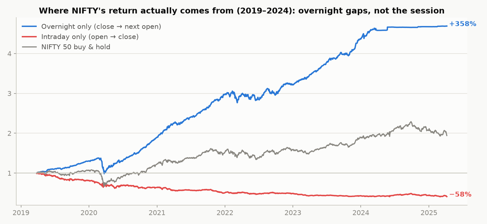
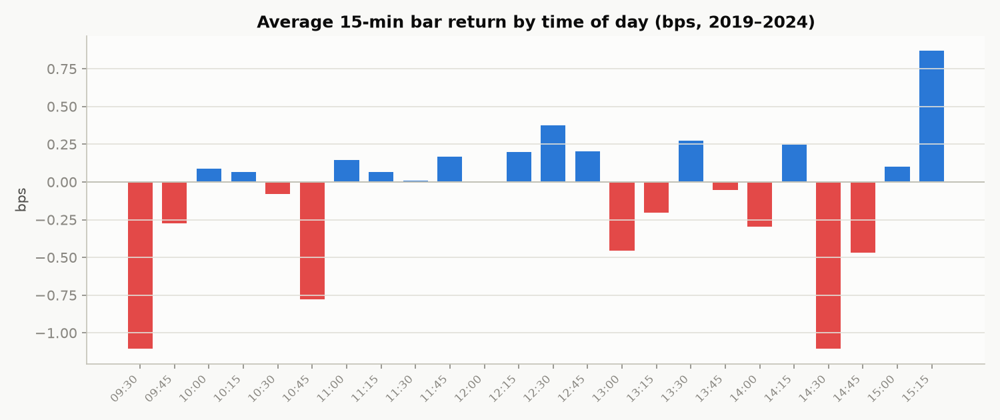
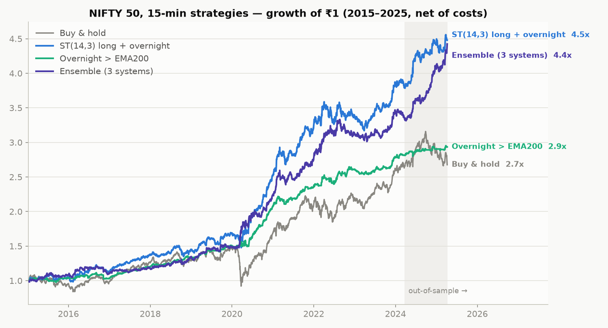
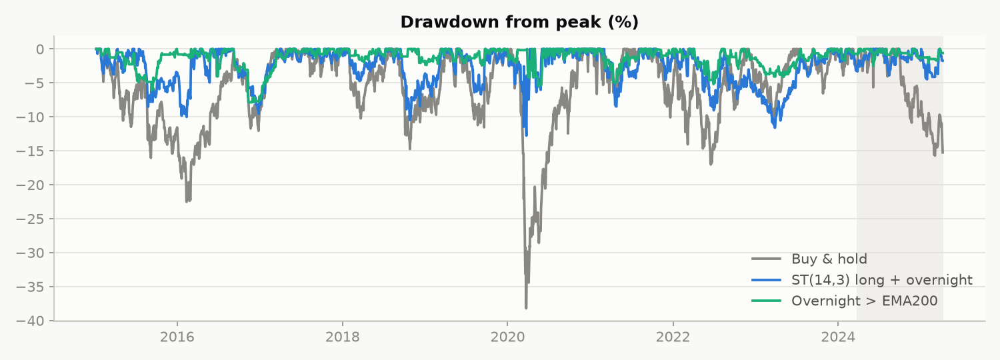
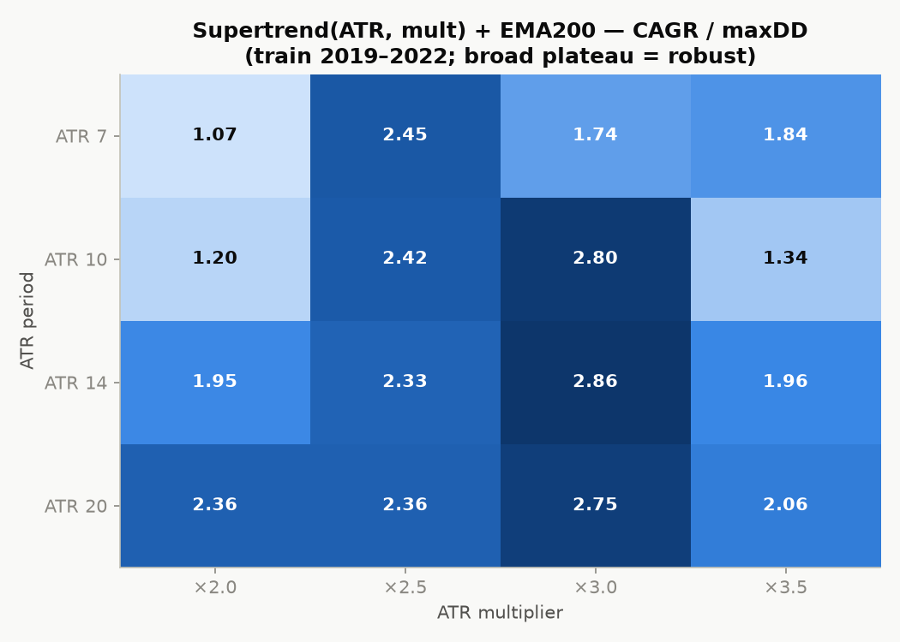

# NSE (NIFTY 50) 15-Minute Strategy Analysis — 2015–2024

A systematic study of the NIFTY 50 index on the **15-minute timeframe** over ~9 years
(2015-01-09 → 2024-03-26, 56,748 bars), covering intraday chart behavior, indicator
strategy backtests with train/test validation, and a final recommended strategy with
high return, low drawdown and a healthy profit factor.

> **Data**: NIFTY 50 spot, 1-minute OHLC resampled to 15-minute session bars
> (09:15–15:15 IST, 25 bars/day), from the public dataset
> [sandeepkapri/Nifty50-Minute-Data](https://github.com/sandeepkapri/Nifty50-Minute-Data).
> Live market APIs are not reachable from this environment, so the sample ends
> 2024-03-26. Re-run `src/download_data.py` (or swap in your broker's data) to refresh.
>
> **Costs**: 0.025% per side (NIFTY futures friction + slippage) charged on every
> position change. All results below are **net of costs**. Signals are computed on
> bar close and executed on the next bar — no lookahead.

---

## 1. What the chart actually does (pattern analysis, 2019–2024)



**Finding #1 — the single most important structural pattern: all of NIFTY's return
is overnight.** Holding only close→next-open (the gap) compounded **+358%** over five
years; holding only open→close (the trading session) compounded **−58%**. Mean gap =
+12.6 bps/day, mean session = −6.6 bps/day.

Consequences:
- **Intraday-only long strategies fight a negative drift** — every popular intraday
  system we tested (EMA cross, VWAP trend, Bollinger breakout, ORB with square-off)
  loses money net of costs on this index.
- **Positional/swing systems that carry overnight** capture the drift and win.



**Finding #2 — time-of-day patterns**: the first half-hour (09:30 bar) and the
14:00–14:45 stretch are the weakest bars; 12:15–12:45 and the 15:00–15:15 close-in
bars are the strongest. Volatility is U-shaped (highest at open and close).

**Finding #3 — mild 15-min momentum**: lag-1 autocorrelation of 15-min returns is
**+0.039** (positive out to lag 3). Trend/breakout beats mean-reversion at this
frequency — confirmed by RSI(2) dip-buying losing (−7.7% CAGR) while trend systems won.

**Finding #4 — first-hour breakout follow-through**: on the 53% of days that break
the first-hour high, the average session return is **+44 bps vs −7 bps** for all days.
Breakouts from the opening range have real follow-through — but after costs and stops,
square-off-by-close ORB still nets out flat; the edge is captured better by staying in
the swing trend.

**Finding #5 — day-of-week**: Monday is the only negative day (−13 bps c2c);
Tuesday the strongest (+28 bps).

---

## 2. Strategy tournament (walk-forward validated)

14 indicator strategies were tested, then the survivors were parameter-searched on a
**train window (2019-03 → 2022-03)** and validated untouched on **test (2022-04 →
2024-03)** and a second out-of-sample regime (**2015 → 2019**). Highlights, full period
2015–24 net of costs (buy & hold: 11.2% CAGR, −38.8% maxDD):

| Strategy (15-min) | CAGR | maxDD | Sharpe | Profit factor | Win rate | Trades |
|---|---|---|---|---|---|---|
| **ST(14,3) long + overnight — RECOMMENDED** | **15.6%** | **−14.0%** | 1.26 | **1.55** | 47% | 1,100 |
| Overnight gap > EMA200 (lowest risk) | 11.9% | **−7.9%** | **1.77** | **1.75** | 62% | 1,378 |
| Ensemble (3 trend systems) | 13.9% | −10.2% | 1.35 | 1.38 | 28% | 1,943 |
| ST(14,3) long-only swing | 13.3% | −14.7% | 1.15 | 1.53 | 45% | 825 |
| Supertrend(14,3)+EMA200 long/short | 13.0% | −13.4% | 1.08 | 1.37 | 31% | 1,621 |
| ORB 30-min + 1 ATR stop (intraday) | −3.2% | −32.6% | −0.32 | 1.10 | 37% | 3,536 |
| EMA 9/21 ×EMA200 (intraday square-off) | −12.5% | −72.6% | −1.17 | 0.87 | 38% | 3,261 |




**Robustness.** The Supertrend parameter surface is a broad plateau (any ATR 10–20 ×
mult 2.5–3.5 works — see heatmap), which is what you want; a strategy that only works
at one magic setting is curve-fit. Donchian(10) looked great in-sample and **failed
both out-of-sample windows** — a textbook overfit that the walk-forward test caught.



---

## 3. The recommended strategy

### "Supertrend swing + overnight-gap capture" (long-only, positional)

**Rules** (all on 15-minute NIFTY bars, signals at bar close):

1. **Trend leg** — be LONG while `Supertrend(ATR 14, mult 3.0)` direction is up.
   Exit (go flat) when it flips down. Positions are carried overnight — that's
   where the return lives (Finding #1).
2. **Gap leg** — on days the trend leg is flat: if `Close > EMA(200)` on the
   15:15 bar, buy the close and exit at the next day's first-bar close
   (pure overnight-gap capture, in the market ~15 minutes + one night).
3. No shorts. No leverage. Square off nothing intraday — the intraday session is
   the part with negative drift.

**Performance, net of 0.025%/side (2015–2024):**

| Window | CAGR | maxDD | Profit factor | vs Buy & hold |
|---|---|---|---|---|
| Train 2019–22 | 31.6% | −14.0% | 1.90 | 14.8% / −38.8% |
| Test 2022–24 (out-of-sample) | 4.4% | −12.3% | 1.23 | 12.4% / −15.9% |
| Old 2015–19 (out-of-sample) | 10.6% | −10.6% | 1.43 | 8.1% / −24.1% |
| **Full 2015–24** | **15.6%** | **−14.0%** | **1.55** | 11.2% / −38.8% |

- Beats buy & hold by ~4.4%/yr with **a third of the drawdown** (−14% vs −39%);
  it sidestepped both the 2020 COVID crash (B&H −38.8%) and most of 2022.
- Positive in **every** validation window. In the 2022–24 low-volatility chop it
  underperforms buy & hold on return (4.4% vs 12.4%) — trend systems pay an
  insurance premium in quiet ranges; the drawdown protection is what you buy.
- Cost-robust: still ~+8.8% CAGR even if you double the friction assumption to
  0.05%/side.

**If you want minimum drawdown instead**, the standalone **overnight-gap > EMA200**
system is the best risk-adjusted line in the study: 11.9% CAGR with only **−7.9%**
maxDD, PF 1.75, 62% win rate, Sharpe 1.77 — but it trades twice a day, so it needs
tight execution (futures at the close auction, ~1 pt slippage).

---

## 4. What did NOT work (equally important)

| Idea | Result | Why |
|---|---|---|
| Intraday square-off versions of everything | −7% to −16% CAGR | negative session drift + 2×costs/day |
| VWAP trend following (intraday) | −16% CAGR | chop around VWAP shreds it |
| RSI(2) mean reversion | −7.7% CAGR | 15-min NIFTY trends, doesn't revert |
| Donchian(10) breakout | +22% train, **−10% test** | overfit — killed by validation |
| Plain Supertrend long/short | great 2019–22, −1 to −3% 2022–24 | shorts bleed in low-vol uptrend chop |

---

## 5. Reproduce it

```bash
pip install -r requirements.txt
python src/run_backtests.py     # every table above
python src/make_charts.py       # every chart (run from src/, expects ../data)
python src/download_data.py     # rebuild the 15-min dataset from source
```

- `src/engine.py` — vectorized backtester (no-lookahead, costs, trade extraction,
  metrics) + indicators (EMA, RSI, ATR, Supertrend, VWAP, MACD).
- `src/strategies.py` — the final strategies with docstrings.
- `extensions/` — deeper studies: short-selling, futures leverage/vol-targeting,
  and options overlays (see below).

## 6. Extensions: shorts, leverage, options — and the maximum-return stack

Three deeper studies were run in parallel on top of this base (each with its own
train/test/old-regime validation and a `results.md`):

### 6.1 [Short-selling](extensions/short_selling/results.md)

The only short edge that survived out-of-sample: **ORB breakdown short** — short a
15-min close below the first 30 minutes' low while `Close < EMA200`, stop at
entry + 1.5×ATR(14), square off 15:15, never held overnight. Profit factor
**1.24–1.25 in all three regimes** (rare consistency). Standalone it makes only
+1.2–3% CAGR, but as an overlay when the long book is flat it **raises CAGR in
every window and cuts drawdown in two of three** (test: 3.8%→5.4% CAGR, DD
−13.0%→−9.9%). Rejected after out-of-sample failure: VWAP-band shorts, Monday
shorts, PM-weakness shorts, RSI fades, Supertrend shorts (even vol-gated).

### 6.2 [Futures leverage & sizing](extensions/leverage/results.md)

**Volatility targeting**: size = min(3×, 20% ÷ trailing 20-day EWMA vol), lagged a
day. Mean leverage 1.61×; de-levers into storms *before* they hit (worst single day
−4.75% — better than the unlevered book's −7.96%, because it was below 1× going
into COVID). Rejected: 25% vol target (breaches −25% DD), ATR sizing (thinner
buffer), drawdown throttle (costs 4–6pp CAGR for nothing). A walk-forward
re-optimization (rolling 2y-train → 6m-trade) confirmed **Supertrend(14,3) is not
overfit** — 13/15 out-of-sample slices profitable with wandering parameters.

### 6.3 [Options overlays](extensions/options/results.md) *(Black–Scholes simulation — no real chain data; read the caveats)*

- **Covered call (sell 2% OTM weekly against the trend longs)** — clearest winner:
  13.0% CAGR / −16.9% DD / PF 1.87 vs 8.9% / −22.3% / 1.50 bare, robust across IV
  assumptions.
- **Protective put (5% OTM monthly)** — costs ~1.6–3 CAGR pts, cuts buy-&-hold DD
  −34%→−19% (COVID: −4% vs −17%).
- **Trend-gated put selling** — cash-plus yield (PF 2.08, 92% wins, −4.5% DD) but
  its COVID escape is partly a gate artifact; treat modestly.
- **Doesn't work**: ungated put selling (one week of March 2020 erased ~3 years of
  premium) and buying weekly ATM calls as the trend vehicle (theta eats the edge,
  PF 0.80).

### 6.4 The maximum-return stack ([`extensions/full_stack.py`](extensions/full_stack.py))

All validated layers combined — long book + ORB short overlay + vol targeting —
net of costs **and** a 4.5%/yr futures carry drag on long notional:

| Layer (cumulative) | Full 2015–24 CAGR | maxDD | Sharpe | PF | Test 22–24 CAGR |
|---|---|---|---|---|---|
| 1. Combo long book (carry-adjusted) | 12.8% | −14.8% | 1.06 | 1.55 | 1.3% |
| 2. + ORB short overlay | 14.1% | −13.0% | 1.15 | 1.40 | 2.9% |
| 3. + vol targeting ≤3× | **21.7%** | −16.6% | **1.31** | 1.43 | **12.0%** |

Every layer improves return in **every** validation window; the stack's worst
single day over 9 years was −5.2%. The residual (unobserved) tail: a large
overnight gap arriving while at the 3× cap. Leverage is only viable at
futures-grade friction — at 0.05%/side the levered edge collapses.

---

## Honest caveats

- **Backtest ≠ future.** All figures are net of assumed costs on historical data;
  regime change (e.g. the 2023-24 low-vol grind) visibly compresses trend returns.
- The dataset is **spot index** prices; you trade futures — basis, rollover and
  carry (~4–5%/yr on longs vs spot in contango) shave real-world returns.
  The overnight-gap leg in particular depends on close/open execution quality.
- Sample ends 2024-03; validate on 2024-26 data before trading.
- The overnight-gap edge is well documented publicly, and crowded edges decay.
- Nothing here is investment advice.
